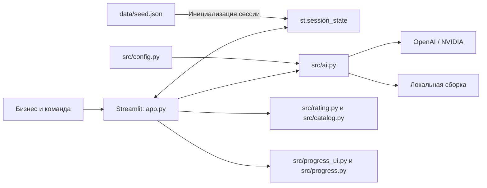

# Практикум — от бизнес-задачи к студенческому проекту

MVP для хакатона **HackAlem AI / AI Sana**, кейс «Геймификация практических заданий».

**Практикум** помогает бизнесу превратить краткое описание проблемы в понятную задачу для студентов. AI задаёт уточняющие вопросы и собирает карточку, бизнес проверяет её, а команды предлагают решения. Рейтинг показывает готовность задачи к работе; баллы опыта команды начисляются за этапы, принятые бизнесом.

**Быстрая проверка:** запустите приложение, выберите «Локальный сценарий» и пройдите [демо для жюри](#8-как-проверить-решение). Для этого API-ключи не нужны.

> Это демонстрационный MVP с данными в `st.session_state`. Переключайте роли в **одной вкладке браузера**: разные сессии не имеют общего каталога и откликов.

## 1. Какую проблему решает проект

Краткое описание бизнес-проблемы часто не содержит данных, ограничений или критериев приёмки. Студенческой команде сложно понять, что предстоит сделать и как будет оцениваться результат.

Проект предназначен для двух сторон:

- **Представитель бизнеса** уточняет задачу, публикует её, сравнивает предложения и принимает результаты.
- **Студенческая команда** выбирает задачу из каталога, предлагает подход и показывает прогресс по этапам.

## 2. Что реализовано

| Возможность | Что доступно в MVP |
|---|---|
| Две роли | Переключение «Бизнес» / «Студенческая команда» в одном приложении без регистрации |
| Конструктор задачи | Свободный черновик, анализ полноты, не менее трёх уточняющих вопросов, сохранение ответов |
| Карточка | Десять редактируемых полей, выбор темы и ручное подтверждение публикации |
| Рейтинг | 0–100 баллов, четыре уровня, расшифровка, подсказки и пересчёт после подтверждённого изменения |
| Каталог | Все опубликованные карточки в текущей сессии, сортировка по рейтингу, фильтры по теме и готовности |
| Отклики | Идея, план, предполагаемый срок и необязательная ссылка на прототип; количество предложений не ограничено |
| Выбор бизнеса | Сравнение предложений, ручной выбор одной или нескольких команд либо отклонение; можно не выбрать никого |
| Прогресс команд | Последовательные этапы, отчёты, приёмка или возврат на доработку, история попыток |
| Геймификация | Рейтинг готовности бизнес-задачи, XP, уровни опыта и достижения команд |
| AI и резерв | Адаптеры OpenAI и NVIDIA, выбор провайдера, валидация ответа, локальная сборка при сбое |

Поля карточки: **название, контекст, потребность, пользователи, данные и материалы, ограничения, ожидаемый результат, критерии успеха, контакт, формат взаимодействия**. Название компании задаётся в сайдбаре; студенты выбирают один из подготовленных профилей команд.

## 3. Как работает решение

1. **Черновик.** Бизнес описывает проблему своими словами.
2. **Уточнение.** Помощник выделяет уже сообщённые сведения, находит пробелы и задаёт вопросы.
3. **Карточка.** Из черновика и ответов собираются поля. Бизнес редактирует текст и видит предварительный рейтинг.
4. **Подтверждение.** Кнопка «Подтвердить и опубликовать» помещает карточку в каталог. Дополнения опубликованной задачи подтверждаются отдельно.
5. **Каталог и отклик.** Команда изучает условия и отправляет предложение. Низкий рейтинг не запрещает отклик.
6. **Выбор.** Бизнес самостоятельно выбирает исполнителей. AI не назначает команды.
7. **Работа и приёмка.** Выбранная команда сдаёт этап. Бизнес принимает его или возвращает с комментарием.
8. **Результат.** После приёмки команда получает XP и доступ к следующему этапу.

### Как используется AI

В `src/ai.py` реализованы два вызова: `analyze_draft()` и `build_card()`. Модель получает пользовательские источники отдельно от системного промпта. Для полей она возвращает ссылки на источники и цитаты, а на этапе анализа — также недостающие поля и вопросы.

Приложение проверяет JSON, допустимые поля, повторы и наличие цитат в исходном тексте с нормализацией пробелов. Поля карточки собираются из проверенных цитат. Это подтверждает происхождение текста, но не гарантирует правильную смысловую классификацию: карточку обязательно проверяет человек.

При отсутствии ключей, таймауте, ошибке доступа или некорректном ответе включается локальная сборка. Она использует шаблонные вопросы, подписанные поля черновика и введённые ответы. Это детерминированный резервный режим, без вызова модели. Причина перехода доступна в интерфейсе.

## 4. Рейтинг и геймификация

### Паспорт готовности бизнес-задачи

Рейтинг вычисляется чистой функцией `calculate_rating()` без AI и сетевых запросов.

| Показатель | Максимум | Распределение |
|---|---:|---|
| Контекст и потребность | 20 | 10 + 10 |
| Данные и материалы | 20 | 20 |
| Ожидаемый результат | 15 | 15 |
| Критерии успеха | 15 | 15 |
| Ограничения | 10 | 10 |
| Пользователи | 10 | 10 |
| Связь с бизнесом | 10 | Контакт 5 + формат взаимодействия 5 |
| **Всего** | **100** | Название и тема баллов не добавляют |

Пустое поле, известная заглушка или очевидный повторяющийся мусор дают 0. Короткий ответ даёт половину веса с округлением вниз; ответ достаточной длины — полный вес. Пороги: контекст — 35 символов, потребность — 20, данные — 15, результат и критерии — по 20, ограничения — 14, пользователи — 10, контакт — 5, формат — 12. Правила находятся в [src/rating.py](src/rating.py).

| Баллы | Уровень |
|---|---|
| 0–39 | Черновик |
| 40–69 | Рабочая |
| 70–89 | Готовая |
| 90–100 | Приоритетная |

До публикации показывается предпросмотр. После подтверждения рейтинг определяет позицию карточки. При равных баллах выше расположена карточка с более ранней датой создания, затем сравнивается ID. Подтверждённое редактирование показывает изменение балла и позиции.

**Рейтинг оценивает полноту описания, а не известность компании, истинность сведений или бизнес-ценность идеи.** Опубликованная карточка уровня «Черновик» остаётся доступной командам.

### Маршрут команды до результата

| Этап | XP после приёмки бизнесом |
|---|---:|
| План согласован | 20 |
| Прототип проверен | 40 |
| Результат принят | 60 |
| **Полный проект** | **120** |

Отправка отклика, выбор команды и сдача отчёта сами по себе XP не дают. Следующий этап открывается после приёмки предыдущего. Возврат на доработку требует комментария; попытки сохраняются в истории. Повторные предложения одной команды не создают дополнительные награды за тот же этап задачи.

Уровни опыта: **Старт** — 0 XP, **Исследователь** — 20, **Создатель** — 60, **Практик** — 120, **Опытный практик** — 300. Достижения выдаются за первый принятый план, прототип, завершённый проект и три завершённых проекта. XP команды и рейтинг задачи рассчитываются отдельно.

## 5. Технологии

| Компонент | Использование |
|---|---|
| Python 3.11+ | Логика приложения и модели данных на `dataclasses` |
| Streamlit `>=1.39,<2.0` | Единственный UI и состояние сессии; отдельного фронтенда нет |
| OpenAI Python SDK `>=1.30,<3.0` | Chat Completions для OpenAI и совместимого NVIDIA API |
| python-dotenv `>=1.0,<2.0` | Чтение локальной конфигурации `.env` |
| JSON | Стартовые данные и формат ответа модели |
| HTML/CSS внутри Streamlit | Общие стили, карточки, индикаторы и шаги конструктора |
| `unittest`, `unittest.mock`, Streamlit `AppTest` | Проверки логики, интерфейса и сквозного сценария |

Модели по умолчанию в коде: **`gpt-4o-mini`** для OpenAI и **`nvidia/nemotron-3-super-120b-a12b`** для NVIDIA. Имена меняются через переменные окружения. Наличие адаптера не означает, что конкретная модель доступна любому ключу.

## 6. Архитектура проекта



`app.py` управляет экранами и действиями. `src/models.py` задаёт структуры карточек и откликов. AI формирует данные для редактирования; рейтинг, порядок каталога и XP рассчитываются Python-функциями. Подтверждённые изменения записываются в состояние сессии, без БД.

```text
app.py                  Роли, конструктор, каталог, отклики и выбор бизнеса
src/
  ai.py                 Промпты, два API, проверка ответа и локальная сборка
  config.py             Настройки окружения и .env
  models.py             Структуры данных и проверка ссылок
  rating.py             Формула рейтинга, уровни и подсказки
  catalog.py            Темы, фильтры, сортировка и глобальная позиция
  progress.py           Этапы, приёмка, XP и достижения
  progress_ui.py        Проекты, отчёты и проверка результатов
  ui.py                 Общие визуальные компоненты и стили
.streamlit/config.toml  Тема Streamlit
data/seed.json          Стартовые задачи, команды и отклики
tests/                  Автоматические проверки
docs/                   Презентация, сценарий и описание AI
requirements.txt        Зависимости
.env.example            Шаблон конфигурации без ключей
.gitignore              Исключения для секретов и локальных файлов
```

## 7. Установка и запуск

### 7.1. Получить исходники

Нужны Python 3.11+ и `pip`; для клонирования — Git. Актуальная версия находится в основной ветке **`main`**. Изменения из [PR №1](https://github.com/BAITC-Hacks/hack-8d5054cd-builders/pull/1) объединены в неё.

```bash
git clone https://github.com/BAITC-Hacks/hack-8d5054cd-builders.git
cd hack-8d5054cd-builders
```

Если исходники уже распакованы из архива, откройте терминал в папке с `app.py` и `requirements.txt` и переходите к следующему шагу.

### 7.2. Установить зависимости

**Windows / PowerShell:**

```powershell
python -m venv .venv
.\.venv\Scripts\python.exe -m pip install -r requirements.txt
if (-not (Test-Path .env)) { Copy-Item .env.example .env }
```

**macOS / Linux:**

```bash
python3 -m venv .venv
.venv/bin/python -m pip install -r requirements.txt
[ -f .env ] || cp .env.example .env
```

Команды сохраняют существующий `.env`. Активация виртуального окружения не требуется: далее используется его интерпретатор напрямую.

### 7.3. Выбрать режим

Для демо без сети измените в `.env` строку:

```dotenv
DEMO_MODE=true
```

Шаблон `.env.example` содержит `DEMO_MODE=false`; его нужно изменить для явного выбора локального режима. Если переменная вообще не задана, код использует `true`.

Для работы с внешним AI установите `DEMO_MODE=false`, выберите провайдера и добавьте свои ключи **только в локальный `.env`**:

```dotenv
DEMO_MODE=false
AI_PROVIDER=auto
AI_TIMEOUT_SECONDS=20
OPENAI_API_KEY=
OPENAI_MODEL=gpt-4o-mini
NVIDIA_API_KEY=
NVIDIA_MODEL=nvidia/nemotron-3-super-120b-a12b
```

| Настройка | Назначение |
|---|---|
| `DEMO_MODE` | Локальный сценарий при старте сессии; источник можно сменить в сайдбаре |
| `AI_PROVIDER` | `auto`, `openai` или `nvidia` |
| `AI_TIMEOUT_SECONDS` | Таймаут одного запроса; по умолчанию 20 секунд, код ограничивает значение диапазоном 3–60 |
| `OPENAI_API_KEY`, `NVIDIA_API_KEY` | Ключи соответствующих провайдеров; для локального режима не нужны |
| `OPENAI_MODEL`, `NVIDIA_MODEL` | Имена моделей, доступных вашим ключам |

В режиме `auto` приложение пробует OpenAI, затем NVIDIA, затем локальную сборку. Провайдер без ключа пропускается. При явном выборе OpenAI или NVIDIA ошибка приводит сразу к локальному резерву. Повторные попытки SDK отключены; два последовательных провайдера могут увеличить время ожидания.

### 7.4. Запустить приложение

**Windows / PowerShell:**

```powershell
.\.venv\Scripts\python.exe -m streamlit run app.py
```

**macOS / Linux:**

```bash
.venv/bin/python -m streamlit run app.py
```

Откройте адрес, показанный в терминале, обычно **[http://localhost:8501](http://localhost:8501)**. Для остановки нажмите `Ctrl+C` в терминале.

После изменения `.env` используйте **«Настройки помощника → Перечитать .env»**. Явно заданные переменные окружения процесса имеют приоритет над файлом. **«Проверить подключение»** отправляет небольшой запрос выбранному API, расходует токены и не проверяет баланс кредитов. В режиме `auto` эта кнопка проверяет оба провайдера.

При обновлении проекта сохраните свой `.env`, установите зависимости заново при их изменении и перезапустите Streamlit. Публикация кода в GitHub сама по себе не разворачивает приложение.

## 8. Как проверить решение

### Воспроизводимый сценарий для жюри

Используйте **новую сессию**, одну вкладку и **«Настройки помощника → Источник AI → Локальный сценарий»**. Внешние API для этого сценария не нужны. В примере используются синтетические сведения, а ответы заранее заполнены для демонстрации.

1. **Черновик.** Роль «Бизнес», компания `Alem Retail`, раздел «Новая задача». Нажмите **«Попробовать на примере»**, затем **«Получить вопросы»**. Появятся вопросы и начальный рейтинг **10 / 100**.
2. **Карточка.** Нажмите **«Сформировать карточку»**. Проверьте десять редактируемых полей и предпросмотр **100 / 100**. Название примера — **«Удобное оформление онлайн-заказов»**.
3. **Неполная публикация.** В группе «Результат и условия» очистите **«Какие материалы есть?»**, нажмите `Ctrl+Enter`, дождитесь пересчёта. Рейтинг станет **80 / 100**, появится подсказка про данные. Нажмите **«Подтвердить и опубликовать»**.
4. **Рост рейтинга.** Перейдите **«К моим задачам и откликам»**, откройте **«Редактировать опубликованную карточку»** и верните текст о данных из блока ниже. Нажмите **«Сохранить изменения и пересчитать рейтинг»**. Ожидается **80 → 100**, а в исходном каталоге из пяти карточек — переход **с 4-го на 2-е место среди 6 задач**.
5. **Отклик.** В той же вкладке переключитесь на «Студенческая команда», профиль **DataCraft**, раздел «Каталог». Найдите новую задачу, раскройте **«Предложить решение»**, заполните идею, план и срок из таблицы ниже. Ссылку можно оставить пустой. Нажмите **«Отправить отклик»**.
6. **Выбор бизнеса.** Вернитесь к бизнесу → «Мои задачи», откройте отклики нужной карточки и нажмите **«Выбрать команду»** для DataCraft. При двух и более предложениях доступна таблица сравнения.
7. **Сдача этапа.** Вернитесь к DataCraft → **«Мои проекты»**. Заполните **«Что сделано и как проверено»** текстом отчёта ниже и нажмите **«Отправить этап на проверку»**. До приёмки XP остаётся **0**.
8. **Подтверждение результата.** Бизнес → «Мои задачи» → нужная задача → «Результаты команд» → **«Подтвердить этап · +20 XP»**. У DataCraft появятся **20 XP**, уровень «Исследователь», достижение и следующий этап.

Текст для восстановления поля данных:

```text
Бизнес может предоставить обезличенные события сайта по просмотрам, корзинам и оформленным заказам за последние три месяца.
```

| Поле | Пример для копирования |
|---|---|
| Идея решения | Найдём этапы оформления с наибольшим числом уходов и предложим прототип улучшенного шага заказа. |
| План работы | Согласуем события и критерии с бизнесом. Построим воронку оформления, проверим причины потерь и протестируем прототип на пяти сценариях. |
| Предлагаемый срок | Четыре недели после согласования доступа к данным. |
| Что сделано и как проверено | Подготовили план работ, определили события воронки и пять сценариев проверки. Зафиксировали вопросы к структуре обезличенных данных и критерии приёмки прототипа. |

Это демонстрационные отчёты, а не подтверждение выполненной работы реальной команды. Позиции и общий XP могут отличаться, если в сессии уже добавлялись задачи или принимались этапы. При использовании живого API формулировки и начальная оценка также могут отличаться.

Дополнительно можно проверить фильтр «Черновик»: исходная карточка с **35 баллами** остаётся доступной для отклика. Следующие два этапа принимаются аналогично и доводят награду за проект до **120 XP**.

### Автоматические проверки

Из корня проекта после установки зависимостей:

```powershell
# Windows / PowerShell
.\.venv\Scripts\python.exe -m unittest discover -s tests -v
```

```bash
# macOS / Linux
.venv/bin/python -m unittest discover -s tests -v
```

В `tests/` есть проверки рейтинга, каталога, стартовых данных, AI-ответов и резервного режима, конфигурации, интерфейса и полного маршрута до 120 XP. Проверяются также доработка, независимый прогресс команд и защита от повторной награды. API в тестах заменены имитациями: настоящие ключи и кредиты не нужны. Эти проверки не подтверждают текущую доступность внешних сервисов.

## 9. Данные и интеграции

### Стартовые данные

[data/seed.json](data/seed.json) содержит **5 черновиков, 5 опубликованных карточек, 5 профилей команд и 5 откликов**. Стартовые баллы карточек — 35, 65, 80, 85 и 100; представлены все четыре уровня готовности. При инициализации сессии баллы пересчитываются по текущей формуле.

Данные учебные. Ссылки прототипов в seed ведут на `example.com` и не являются реальными результатами проектов. Файл читается при создании сессии; новые задачи, отклики и этапы не записываются обратно в JSON. Подготовленный пример конструктора хранится отдельно в `DEMO_DRAFT` и `DEMO_ANSWERS` в `src/ai.py`.

### Внешние API

| Интеграция | Адрес в коде | Назначение |
|---|---|---|
| OpenAI | `https://api.openai.com/v1` | Анализ и сборка; запрос со строгой JSON Schema |
| NVIDIA | `https://integrate.api.nvidia.com/v1` | Анализ и сборка через OpenAI-совместимый API; JSON задаётся промптом и проверяется локально |

Во внешний AI передаются черновик и, на этапе сборки, ответы бизнеса. В `auto` при ошибке первого провайдера эти же данные могут быть переданы второму. В локальном режиме сетевых AI-запросов нет. Ссылки на прототипы приложение не скачивает и автоматически не анализирует.

Ключи читаются через `os.getenv`. `.env`, окружение `.venv` и `.streamlit/secrets.toml` исключены из Git. AI-обёртка возвращает безопасные категории ошибок и не выводит ключи, заголовки запросов или тексты исключений. Промпты, JSON-схемы и валидация доступны в [src/ai.py](src/ai.py) и [описании AI](docs/AI-ПРОМПТЫ.md).

## 10. Ограничения текущей версии

- **Нет постоянного хранения.** Данные находятся в памяти сессии Streamlit. Новая вкладка или браузер получает отдельный набор; перезапуск сервера или потеря сессии может сбросить изменения.
- **Нет авторизации и совместной работы между устройствами.** Название компании и выбор профиля — элементы демонстрации, а не проверка личности или полноценное разграничение доступа.
- **Профили команд подготовлены заранее.** Регистрация и создание новых команд через UI не реализованы.
- **Рейтинг использует эвристику длины и заполненности.** Длинный текст не обязательно полезен; правдивость, измеримость критериев и фактическую готовность подтверждает человек.
- **AI может ошибаться в смысле.** Проверка цитат ограничивает добавление неподтверждённого текста в поля, но не доказывает правильность их классификации или вопросов модели.
- **Внешние API зависят от ключа, квоты, сети и доступности модели.** Локальный режим позволяет продолжить работу, но не заменяет полноценный семантический анализ.
- **Результаты принимает бизнес вручную.** Приложение не проверяет работоспособность прототипов и не доказывает выполнение отчёта; XP отражает факт ручной приёмки.
- **Нет чата, уведомлений, календаря, загрузки файлов, персональных AI-рекомендаций и обучения собственной модели.** Результаты передаются текстом и ссылкой.

## 11. Развёрнутая версия и материалы

**Ссылка на публично развёрнутое приложение в текущем репозитории не указана.** Доступен локальный запуск по инструкции выше. Адрес `localhost:8501` работает только на компьютере, где запущен Streamlit.

- [Исходный код на GitHub](https://github.com/BAITC-Hacks/hack-8d5054cd-builders).
- [Актуальная версия — ветка main](https://github.com/BAITC-Hacks/hack-8d5054cd-builders/tree/main).
- [Презентация PowerPoint](docs/Практикум-защита.pptx).
- [Сценарий защиты на 5 минут и ответы жюри](docs/СЦЕНАРИЙ-ЗАЩИТЫ.md).
- [Резюме MVP](docs/РЕЗЮМЕ-MVP.md).
- [Сверка реализации с кейсом](docs/СВЕРКА-С-КЕЙСОМ.md).
- [Промпты, форматы входа и выхода, обработка ошибок](docs/AI-ПРОМПТЫ.md).
